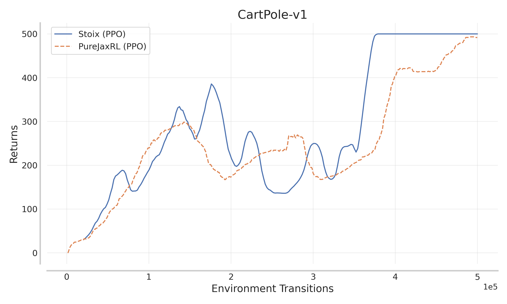
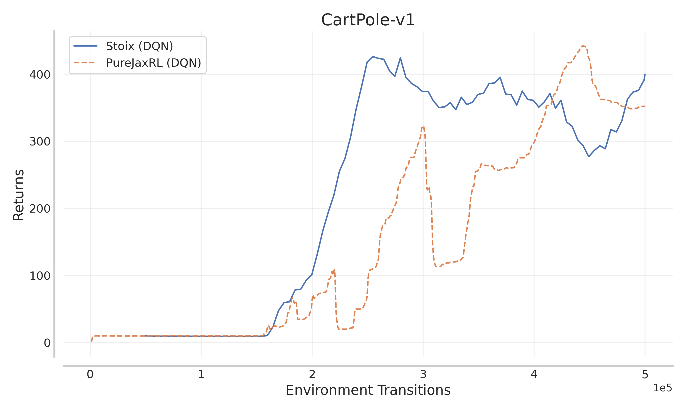
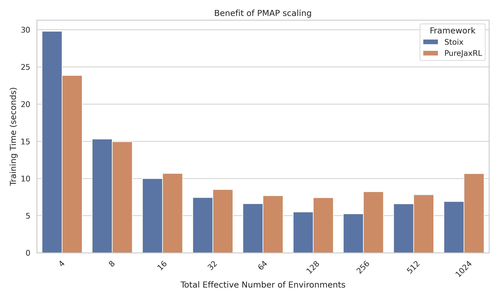

<p align="center">
    <a href="docs/images/stoix.png">
        
    </a>
</p>

<div align="center">
<a href="https://www.python.org/doc/versions/">
      
</a>
<a  href="https://github.com/instadeepai/Mava/blob/main/LICENSE">
    
</a>
<a  href="https://github.com/psf/black">
    
</a>
<a  href="http://mypy-lang.org/">
    
</a>
<a href="https://zenodo.org/doi/10.5281/zenodo.10916257"></a>
</div>

<h2 align="center">
    <p>Distributed Single-Agent Reinforcement Learning End-to-End in JAX</p>
</h2>

<div align="center">

**_stoic - a person who can endure pain or hardship without showing their feelings or complaining._**

</div>

## Welcome to Stoix! 🏛️

Stoix provides simplified code for quickly iterating on ideas in single-agent reinforcement learning with useful implementations of popular single-agent RL algorithms in JAX allowing for easy parallelisation across devices with JAX's `pmap`. All implementations are fully compiled with JAX's `jit` thus making training and environment execution very fast. However, this does require environments written in JAX. For environments not written in JAX, Stoix offers Sebulba systems (see below). Algorithms and their default hyperparameters have not been optimised for any specific environment and are useful as a starting point for research and/or for initial baselines before hyperparameter tuning.

To join us in these efforts, please feel free to reach out, raise issues or read our [contribution guidelines](#contributing-) (or just star 🌟 to stay up to date with the latest developments)!

Stoix is fully in JAX with substantial speed improvement compared to other popular libraries. We currently provide native support for the [Jumanji][jumanji] environment API and wrappers for popular RL environments.

## System Design Paradigms
Stoix offers two primary system design paradigms (Podracer Architectures) to cater to different research and deployment needs:

- **Anakin:** Traditional Stoix implementations are fully end-to-end compiled with JAX, focusing on speed and simplicity with native JAX environments. This design paradigm is ideal for setups where all components, including environments, can be optimized using JAX, leveraging the full power of JAX's pmap and jit. For an illustration of the Anakin architecture, see this [figure](docs/images/anakin_arch.jpg) from the [Mava][mava] technical report or the original podracer [paper][anakin_paper].

- **Sebulba:** The Sebulba system introduces flexibility by allowing different devices to be assigned specifically for learning and acting. In this setup, acting devices serve as inference servers for multiple parallel environments, which can be written in any framework, not just JAX. Each set of parallel environments can run on separate threads asynchronously. This enables Stoix to be used with a broader range of environments while still benefiting from JAX's speed. For an illustration of the Sebulba architecture, see this [animation](docs/images/sebulba_arch.gif) from the [InstaDeep Sebulba implementation](https://github.com/instadeepai/sebulba/). Whilst one could optimisie for throughput of data to purely maximise performance, Stoix aims to serve as a research codebase, thus, we take inspiration from [cleanba][cleanba] which focused on ensuring reproducibility and algorithm correctness. With this in mind, one could easily adapt the sebulba systems to optimise for throughput.

Not all implementations have both Anakin and Sebulba implementations but effort has gone into making the two implementations as similar as possible to allow easy conversion.

## Code Philosophy 🧘

The current code in Stoix was initially **largely** taken and subsequently adapted from [Mava][mava]. As Mava develops, Stoix will hopefully adopt their optimisations that are relevant for single-agent RL. Like Mava, Stoix is not designed to be a highly modular library and is not meant to be imported. Our repository focuses on simplicity and clarity in its implementations while utilising the advantages offered by JAX such as `pmap` and `vmap`, making it an excellent resource for researchers and practitioners to build upon. Stoix follows a similar design philosophy to [CleanRL][cleanrl] and [PureJaxRL][purejaxrl], where we allow for some code duplication to enable readability, easy reuse, and fast adaptation. A notable difference between Stoix and other single-file libraries is that Stoix makes use of abstraction where relevant. It is not intended to be purely educational with research utility as the primary focus. In particular, abstraction is currently used for network architectures, environments, logging, and evaluation.

## Overview 🦜

### Stoix TLDR
1. **Algorithms:** Stoix offers easily hackable, single-file implementations of popular algorithms in pure JAX. You can vectorize algorithm training on a single device using `vmap` as well as distribute training across multiple devices with `pmap` (or both). Multi-host support (i.e., vmap/pmap over multiple devices **and** host machines/nodes) is coming soon! All implementations include checkpointing to save and resume parameters and training runs.

2. **System Designs:** Choose between Anakin systems for fully JAX-optimized workflows or Sebulba systems for flexibility with non-JAX environments.

3. **Hydra Config System:** Leverage the Hydra configuration system for efficient and consistent management of experiments, network architectures, and environments. Hydra facilitates the easy addition of new hyperparameters and supports multi-runs and Optuna hyperparameter optimization. No more need to create large bash scripts to run a series of experiments with differing hyperparameters, network architectures or environments.

4. **Advanced Logging:** Stoix features advanced and configurable logging, ready for output to the terminal, TensorBoard, and other ML tracking dashboards (WandB and Neptune). It also supports logging experiments in JSON format ready for statistical tests and generating RLiable plots (see the notebook in the plotting folder). This enables statistically confident comparisons of algorithms natively.

Stoix currently offers the following building blocks for Single-Agent RL research:

### Implementations of Algorithms 🥑

- **Deep Q-Network (DQN)** - [Paper](https://arxiv.org/abs/1312.5602)
- **Double DQN (DDQN)** - [Paper](https://arxiv.org/abs/1509.06461)
- **Dueling DQN** - [Paper](https://arxiv.org/abs/1511.06581)
- **Categorical DQN (C51)** - [Paper](https://arxiv.org/abs/1707.06887)
- **Munchausen DQN (M-DQN)** [Paper](https://arxiv.org/abs/2007.14430)
- **Quantile Regression DQN (QR-DQN)** - [Paper](https://arxiv.org/abs/1710.10044)
- **DQN with Regularized Q-learning (DQN-Reg)** [Paper](https://arxiv.org/abs/2101.03958)
- **Parallelised Q-network (PQN)** [Paper](https://arxiv.org/abs/2407.04811)
- **Rainbow** - [Paper](https://arxiv.org/abs/1710.02298)
- **Recurrent Experience Replay in Distributed Reinforcement Learning (R2D2)** - [Paper](https://openreview.net/pdf?id=r1lyTjAqYX)
- **REINFORCE With Baseline** - [Paper](https://people.cs.umass.edu/~barto/courses/cs687/williams92simple.pdf)
- **Deep Deterministic Policy Gradient (DDPG)** - [Paper](https://arxiv.org/abs/1509.02971)
- **Twin Delayed DDPG (TD3)** - [Paper](https://arxiv.org/abs/1802.09477)
- **Distributed Distributional DDPG (D4PG)** - [Paper](https://arxiv.org/abs/1804.08617)
- **Soft Actor-Critic (SAC)** - [Paper](https://arxiv.org/abs/1801.01290)
- **Proximal Policy Optimization (PPO)** - [Paper](https://arxiv.org/abs/1707.06347)
- **Discovered Policy Optimization (DPO)** [Paper](https://arxiv.org/abs/2210.05639)
- **Maximum a Posteriori Policy Optimisation (MPO)** - [Paper](https://arxiv.org/abs/1806.06920)
- **On-Policy Maximum a Posteriori Policy Optimisation (V-MPO)** - [Paper](https://arxiv.org/abs/1909.12238)
- **Advantage-Weighted Regression (AWR)** - [Paper](https://arxiv.org/abs/1910.00177)
- **AlphaZero** - [Paper](https://arxiv.org/abs/1712.01815)
- **MuZero** - [Paper](https://arxiv.org/abs/1911.08265)
- **Sampled Alpha/Mu-Zero** - [Paper](https://arxiv.org/abs/2104.06303)
- **Sequential Monte Carlo Policy Optimisation (SPO)** - [Paper](https://proceedings.neurips.cc/paper_files/paper/2024/file/01fb6de3360f9e32862665580e2c5853-Paper-Conference.pdf)
- **IMPALA** - [Paper](https://arxiv.org/abs/1802.01561)

### Environment Wrappers 🍬
Stoix offers wrappers for:

- **JAX environments:** [Gymnax][gymnax], [Jumanji][jumanji], [Brax][brax], [XMinigrid][xminigrid], [Craftax][craftax], [POPJym][popjym], [Navix][navix] and more.
- **Non-JAX environments:** [Envpool][envpool] and [Gymnasium][gymnasium].

### Statistically Robust Evaluation 🧪
Stoix natively supports logging to json files which adhere to the standard suggested by [Gorsane et al. (2022)][toward_standard_eval]. This enables easy downstream experiment plotting and aggregation using the tools found in the [MARL-eval][marl_eval] library.

## Performance and Speed 🚀

As the code in Stoix (at the time of creation) was in essence a port of [Mava][mava], for further speed comparisons we point to their repo. Additionally, we refer to the PureJaxRL blog post [here](https://chrislu.page/blog/meta-disco/) where the speed benefits of end-to-end JAX systems are discussed. Lastly, we point to the Podracer architectures paper [here][anakin_paper] where these ideas were first discussed and benchmarked.

Below we provide some plots illustrating that Stoix performs equally to that of [PureJaxRL][purejaxrl] but with the added benefit of the code being already set up for `pmap` distribution over devices as well as the other features provided (algorithm implementations, logging, config system, etc).
<p align="center">
 
</p>
I've also included a plot of the training time for 5e5 steps of PPO as one scales the number of environments. PureJaxRL does not pmap and thus runs on a single a device.

<p align="center">
  
</p>

Lastly, please keep in mind for practical use that current networks and hyperparameters for algorithms have not been tuned.

## Installation 🎬

At the moment Stoix is not meant to be installed as a library, but rather to be used as a research tool.

You can use Stoix by cloning the repo and installing via UV as follows:

```bash
git clone https://github.com/EdanToledo/Stoix.git
cd Stoix
pipx install uv
uv sync
source .venv/bin/activate
```

We have tested `Stoix` on Python 3.10. Note that because the installation of JAX differs depending on your hardware accelerator,
we advise users to explicitly install the correct JAX version (see the [official installation guide](https://github.com/google/jax#installation)).

## Quickstart ⚡

To get started with training your first Stoix system, simply run one of the system files. e.g.,

For an Anakin system:

```bash
python stoix/systems/ppo/anakin/ff_ppo.py
```

or for a Sebulba system:

```bash
python stoix/systems/ppo/sebulba/ff_ppo.py arch=sebulba env=envpool/pong network=visual_resnet
```

Stoix makes use of Hydra for config management. In order to see our default system configs please see the `stoix/configs/` directory. A benefit of Hydra is that configs can either be set in config yaml files or overwritten from the terminal on the fly. For an example of running a system on the CartPole environment and changing any hyperparameters, the above code can simply be adapted as follows:

```bash
python stoix/systems/ppo/anakin/ff_ppo.py env=gymnax/cartpole system.rollout_length=32 system.decay_learning_rates=True
```

Additionally, certain implementations such as Dueling DQN are decided by the network architecture but the underlying algorithm stays the same. For example, if you wanted to run Dueling DQN you would simply do:

```bash
python stoix/systems/q_learning/ff_dqn.py network=mlp_dueling_dqn
```

or if you wanted to do dueling C51, you could do:

```bash
python stoix/systems/q_learning/ff_c51.py network=mlp_dueling_c51
```

### SLURM Launcher for Distributed Experiments

For users with access to SLURM clusters, Stoix includes a lightweight flexible SLURM launcher that leverages Hydra and [submitit](https://github.com/facebookincubator/submitit) to simplify running large-scale experiments in parallel. This launcher lets you easily specify different algorithms (by their execution file), environments (by configs), and seeds --- and it automatically submits a separate job for each combination.

**Key features include:**

- **Hydra Integration:** Configure your experiments and SLURM parameters (such as time, partition, memory, etc.) in a single Hydra config file or override them on the fly from the command line.
- **Parallel Job Submission:** Automatically submits individual SLURM jobs for each experiment combination, enabling you to distribute your workload across multiple nodes and GPUs.
- **Resource Flexibility:** Easily customize your SLURM resource requirements (e.g., nodes, GPUs per node, cpus per task) to best suit your hardware and research needs.

One can also use hydra's built in submitit launcher using the hydra submitit plugin, this launcher is just for ease of use.

**Usage Example:**

To launch your experiments on a SLURM cluster with a custom time limit and partition, run:

```bash
python launcher.py slurm.time=00:30:00 slurm.partition=gpu
```

In this example, the launcher uses the provided overrides to set the job timeout to 30 minutes and submit jobs to the GPU partition. For more advanced configurations, simply adjust or add more overrides as needed.

This SLURM launcher is designed to assist with research, making it simple to scale up your experiments without having to write large batch scripts manually.

## Important Considerations

1. If your environment does not have a timestep limit or is not guaranteed to end through some game mechanic, then it is possible for the evaluation to seem as if it is hanging forever thereby stalling the training but in fact your agent is just so good _or bad_ that the episode never finishes. Keep this in mind if you are seeing this behaviour. One solution is to simply add a time step limit or potentially action masking.

2. Due to the way Stoix is set up, you are not guaranteed to run for exactly the number of timesteps you set. A warning is given at the beginning of a run on the actual number of timesteps that will be run. This value will always be less than or equal to the specified sample budget. To get the exact number of transitions to run, ensure that the number of timesteps is divisible by the rollout length * total_num_envs and additionally ensure that the number of evaluations spaced out throughout training perfectly divide the number of updates to be performed. To see the exact calculation, see the file total_timestep_checker.py. This will give an indication of how the actual number of timesteps is calculated and how you can easily set it up to run the exact amount you desire. Its relatively trivial to do so but it is important to keep in mind.

3. Optimising the performance and speed for Sebulba systems can be a little tricky as you need to balance the pipeline size, the number of actor threads, etc so keep this in mind when applying an algorithm to a new problem.

## Contributing 🤝

Please read our [contributing docs](docs/CONTRIBUTING.md) for details on how to submit pull requests, our Contributor License Agreement and community guidelines.

## Roadmap 🛤️

We plan to iteratively expand Stoix in the following increments:

- 🌴 Support for more environments as they become available.
- 🔁 More robust recurrent systems.
    - [ ] Add recurrent variants of all systems
    - [ ] Allow easy interchangability of recurrent cells/architecture via config
- 📊 Benchmarks on more environments.
    - [ ] Create leaderboard of algorithms
- 🦾 More algorithm implementations:
    - [ ] Muesli - [Paper](https://arxiv.org/abs/2104.06159)
    - [ ] DreamerV3 - [Paper](https://arxiv.org/abs/2301.04104)
- 🎮 Self-play 2-player Systems for board games.

Please do follow along as we develop this next phase!

## Citing Stoix 📚

If you use Stoix in your work, please cite us:

```bibtex
@misc{toledo2024stoix,
    title={Stoix: Distributed Single-Agent Reinforcement Learning End-to-End in JAX},
    doi = {10.5281/zenodo.10916257},
    author={Edan Toledo},
    month = apr,
    year = {2024},
    url = {https://github.com/EdanToledo/Stoix},
}
```

## Acknowledgements 🙏

We would like to thank the authors and developers of [Mava][mava] as this was essentially a port of their repo at the time of creation. This helped set up a lot of the infrastructure of logging, evaluation and other utilities.

## See Also 🔎

**Related JAX Libraries** In particular, we suggest users check out the following repositories:

- 🦁 [Mava](https://github.com/instadeepai/Mava): Distributed Multi-Agent Reinforcement Learning in JAX.
- 🔌 [OG-MARL](https://github.com/instadeepai/og-marl): datasets with baselines for offline MARL in JAX.
- 🌴 [Jumanji](https://github.com/instadeepai/jumanji): a diverse suite of scalable reinforcement learning environments in JAX.
- 😎 [Matrax](https://github.com/instadeepai/matrax): a collection of matrix games in JAX.
- 🔦 [Flashbax](https://github.com/instadeepai/flashbax): accelerated replay buffers in JAX.
- 📈 [MARL-eval](https://github.com/instadeepai/marl-eval): standardised experiment data aggregation and visualisation for MARL.
- 🌀 [DeepMind Anakin][anakin_paper] for the Anakin podracer architecture to train RL agents at scale.
- ♟️ [Pgx](https://github.com/sotetsuk/pgx): JAX implementations of classic board games, such as Chess, Go and Shogi.
- 🔼 [Minimax](https://github.com/facebookresearch/minimax/): JAX implementations of autocurricula baselines for RL.

[jumanji]: https://github.com/instadeepai/jumanji
[cleanrl]: https://github.com/vwxyzjn/cleanrl
[purejaxrl]: https://github.com/luchris429/purejaxrl
[anakin_paper]: https://arxiv.org/abs/2104.06272
[mava]: https://github.com/instadeepai/Mava
[toward_standard_eval]: https://arxiv.org/pdf/2209.10485.pdf
[marl_eval]: https://github.com/instadeepai/marl-eval
[gymnax]: https://github.com/RobertTLange/gymnax/
[brax]: https://github.com/google/brax
[xminigrid]: https://github.com/corl-team/xland-minigrid/
[craftax]: https://github.com/MichaelTMatthews/Craftax
[popjym]: https://github.com/FLAIROx/popjym
[navix]: https://github.com/epignatelli/navix
[envpool]: https://github.com/sail-sg/envpool/
[gymnasium]: https://github.com/Farama-Foundation/Gymnasium
[cleanba]: https://github.com/vwxyzjn/cleanba
